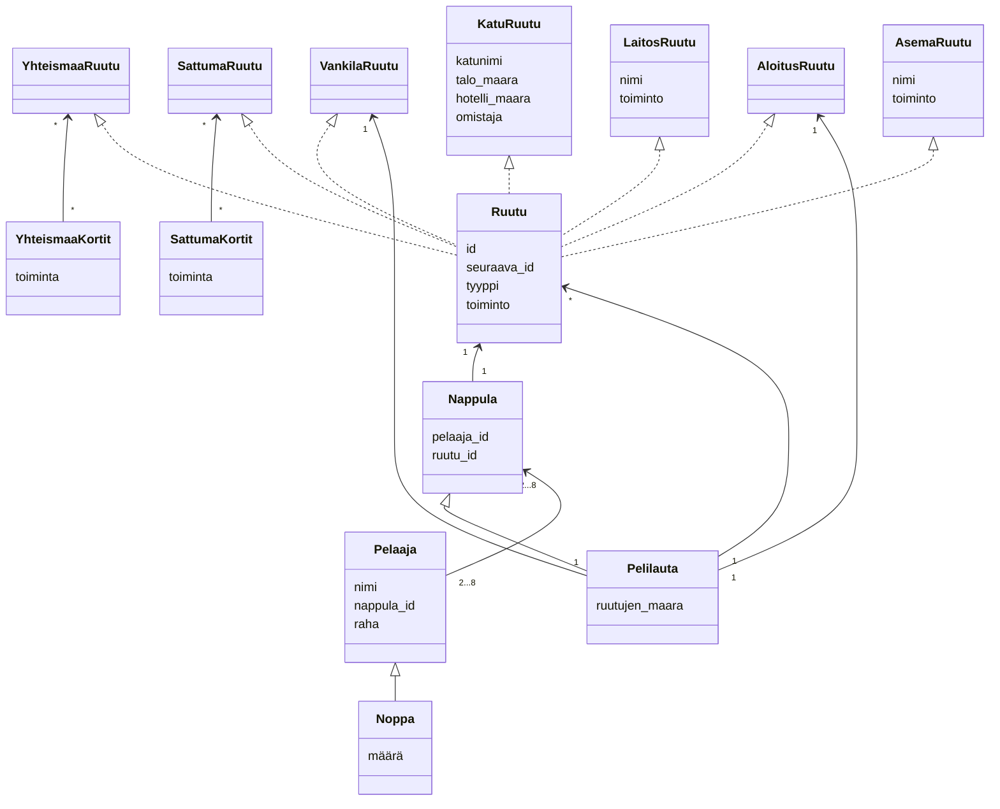

### Monopoli

```mermaid
 classDiagram
    Ruutu "*" <-- "1" Pelilauta
    AloitusRuutu "1" <-- "1" Pelilauta
    VankilaRuutu "1" <-- "1" Pelilauta
    Nappula "2...8" <-- "2...8"  Pelaaja
    Nappula <|-- Pelilauta
    Ruutu "1" <-- "1"  Nappula
    Pelaaja <|-- Noppa
    AloitusRuutu <|.. Ruutu
    VankilaRuutu <|.. Ruutu
    SattumaRuutu <|.. Ruutu
    AsemaRuutu <|.. Ruutu
    LaitosRuutu <|.. Ruutu
    KatuRuutu <|.. Ruutu
    YhteismaaRuutu <|.. Ruutu
    SattumaRuutu "*" <-- "*" SattumaKortit
    YhteismaaRuutu "*" <-- "*" YhteismaaKortit
    
    class Pelilauta{
        ruutujen_maara
    }
    class Ruutu{
        id
        seuraava_id
        tyyppi
        toiminto
    }
    class AloitusRuutu{
    }
    class VankilaRuutu{
    }
    class SattumaRuutu{
    }
    class AsemaRuutu{
        nimi
        toiminto
    }
    class LaitosRuutu{
        nimi
        toiminto
    }
    class KatuRuutu{
        katunimi
        talo_maara
        hotelli_maara
        omistaja
    }
    class YhteismaaRuutu{
    }
    class Pelaaja{
        nimi
        nappula_id
        raha
    }
    class Nappula{
        pelaaja_id
        ruutu_id
    }
    class Noppa{
        määrä
    }
    class YhteismaaKortit{
        toiminta
    }
    class SattumaKortit{
        toiminta
    }
```
