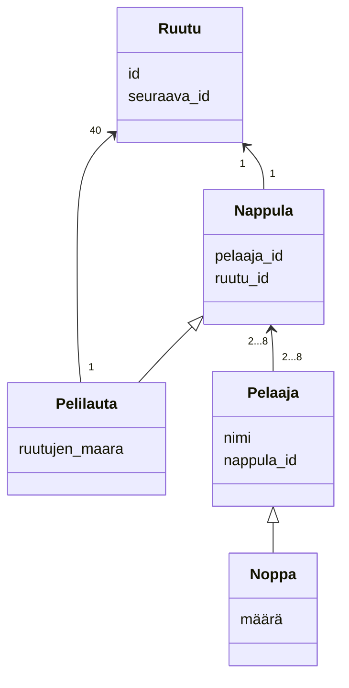

### Monopoli

```mermaid
 classDiagram
    Ruutu "40" <-- "1" Pelilauta
    Nappula "2...8" <-- "2...8"  Pelaaja
    Nappula <|-- Pelilauta
    Ruutu "1" <-- "1"  Nappula
    Pelaaja <|-- Noppa
    class Pelilauta{
        ruutujen_maara
    }
    class Ruutu{
        id
        seuraava_id
    }
    class Pelaaja{
        nimi
        nappula_id
    }
    class Nappula{
        pelaaja_id
        ruutu_id
    }
    class Noppa{
        määrä
    }
```
